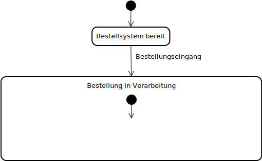

# Die Darstellung eines Geschäftsprozesses als UML-Zustandsdiagramm

Geschäftsprozesse können in verschiedenen Formen dargestellt werden.
Eine Möglichkeit ist das
[UML-Zustandsdiagramm](https://de.wikipedia.org/wiki/Zustandsdiagramm_(UML)).
Um das zu illustrieren, wird in der Folge die Abwicklung einer
Bestellung in einem UML-Zustandsdiagramm dargestellt.

## Darstellungselemente für ein UML Zustandsdiagramm

Für Zustandsdiagramme gelten die folgenden grafischen Standards:

- Zustände werden als Rechtecke mit abgerundeten Ecken dargestellt.
  
  

- Übergänge von einem Zustand in einen anderen Zustand werden als Pfeile
  mit Beschriftung dargestellt.

  

- Der Start wird mit einem ausgefüllten schwarzen Punkt dargestellt.
- Das Ende wird mit einem von einem Ring umgebenen schwarzen Punkt
  dargestellt.

  

- Verzweigungen bzw. Vereinigungen werden durch einen dicken schwarzen
  Strich dargestellt.

  

  

## Der Bestellprozess als UML-Zustandsdiagramm

Um den Bestellprozess als UML-Zustandsdiagramm darstellen zu können,
muss man sich Schritt für Schritt die verschiedenen Phasen, welche 
eine Bestellung durchläuft, als separate Zustände vorstellen.

Damit eine Bestellung entgegengenommen werden kann, muss das
Bestellsystem bereit sein.

Der Übergang in den nächsten Zustand erfolgt durch die *Entgegennahme
einer Bestellung*.

Dieser neue Zustand kann als *Bestellung in Verarbeitung* bezeichnet werden.

Der Zustand *Bestellung in Verarbeitung* ist allerdings kein
monolithischer Block.
Er weist vielmehr verschiedene (Teil-)Zustände auf.
Dazu kann im Inneren des Zustandes *Bestellung in Verarbeitung* ein
weiteres Zustandsdiagramm gezeichnet werden.

Im Zustand *Bestellung in Verarbeitung* ist die Nächste Aktion die
*Freigabe der Bestellung*.

Als nächstes Teilt sich der Prozess auf und es werden zwei parallele
Zustände erreicht: Die *Bereitstellung* der Bestellung sowie die
*Erstellung der Rechnung* für die Bestellung.

Wenn die Ware bereitgestellt ist und die Rechnung erstellt, kann die
Bestellung an die Spedition übergeben werden. Damit wird der Zustand
*Versandbereit* erreicht. Die inneren Zustände sind damit alle
durchlaufen und das Diagramm im inneren kann abgeschlossen werden.

Die versandbereite Bestellung kann an den Kurierdienst für die
Zustellung an an den Kunden übergeben werden.

Mit diesem Diagramm wird der Bestellprozess als eine Folge von Zuständen
und Übergängen zwischen diesen Zuständen dargestellt.