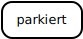

# Die Darstellung der Laufbahn eines Absolventen der KBW als Zustandsdiagramm

Die Laufbahn einer Schülerin bzw. eines Schülers (SuS) an der
Kantonsschule Büelrain kann als
[UML-Zustandsdiagramm](https://de.wikipedia.org/wiki/Zustandsdiagramm_(UML))
grafisch dargestellt werden.

## Darstellungselemente für ein UML Zustandsdiagramm

Für Zustandsdiagramme gelten die folgenden grafischen Standards:

- Zustände werden als Rechtecke mit abgerundeten Ecken dargestellt.
  
  

- Übergänge von einem Zustand in einen anderen Zustand werden als Pfeile
  mit Beschriftung dargestellt.

  

- Der Start wird mit einem ausgefüllten schwarzen Punkt dargestellt.
- Das Ende wird mit einem von einem Ring umgebenen schwarzen Punkt
  dargestellt.

  

- Verzweigungen bzw. Vereinigungen werden durch einen dicken schwarzen
  Strich dargestellt.

  

  

- Entscheidungen werden durch Rauten dargestellt. Die fragliche
  Entscheidung wird als Text daneben geschrieben.

  

- Auflagen bei Übergängen (engl. guard) werden in eckige Klammern
  geschrieben (`[Auflage]`).

## Die KBW Laufbahn

Um die Laufbahn an der KBW als UML-Zustandsdiagramm darstellen zu
können, muss man sich Schritt für Schritt die verschiedenen Phasen,
welche, eine Schülerin oder ein Schüler durchläuft, als separate
Zustände vorstellen.

Die Laufbahn an der KBW beginnt mit der Anmeldung zur Aufnahmeprüfung.
Damit man sich anmelden kann, muss allerdings das Anmeldefenster für die
Aufnahmeprüfung bereit sein. Dies wird mit einem Startzustand
dargestellt.

Allerdings ist man erst nach dem Bezahlen der Anmeldegebühr wirklich
angemeldet. Wird die Anmeldegebühr nicht bezahlt, ist die Laufbahn
beendet, bevor sie wirklich begonnen hat.

Nach der Anmeldung muss die Aufnahmeprüfung bestanden werden. Wenn dies
der Fall ist, ist man an die KBW aufgenommen.

Falls man die KBW erfolgreich durchläuft, wird man zum KBW Alumnus und
die Laufbahn ist beendet.

Der Zustand *Aufgenommen* weist allerdings verschiedene Unterzustände
auf. Deshalb muss in diesem Zustand Platz geschaffen werden, um ein
eigenes Zustandsdiagramm einbetten zu könne.

Innerhalb des Zustands *Aufgenommen* startet ein neuer Prozess.

Standardmässig beginnt die Laufbahn an der KBW mit einer Probezeit.

Wer die Probezeit bestanden hat, wird definitiv aufgenommen. Wer die
Probezeit nicht besteht, muss die Schule verlassen.

Wer per Ende eines Semesters die Promotionsbedingungen erfüllt, bleibt
definitiv und geht nach sechs Semestern an die Abschlussprüfungen (d.h.
er erreicht den Zustand *Prüfungskandidat*).

Wer per Ende eines Semesters die Promotionsbedingungen nicht erfüllt,
wird in den Zustand *provisorisch* versetzt. Wenn er im Anschluss die
Promotionsbedingungen wieder erfüllt, bleibt er in diesem Zustand und
wechselt nach insgesamt sechs Semestern in den Zustand
*Prüfungskandidat*.

Falls jemand im Zustand *provisorisch* die Promotionsbedingungen am Ende
des Semesters ein weiters Mal nicht erfüllt, muss er repetieren. Er wird
also in den Zustand *Repetent* versetzt.

Falls ein Repetent die Promotionsbedingungen am Ende des Semesters ein
weiters Mal nicht erfüllt, muss er die Schule verlassen. Wenn er die
Bedingungen erfüllt, wechselt er nach acht Semestern in den Status
*Prüfungskandidat*.

Wer zur Abschlussprüfung antritt und besteht, verlässt die Schule mit
Erfolg und wechselt in den Zustand *Alumnus*. Wer nicht besteht,
wechselt nach dem ersten Versuch in den Status *Repetent*, nach dem
zweiten Misserfolg muss die Schule ohne Abschluss verlassen werden.

Mit dem letzten Diagramm ist der Prozess der KBW-Laufbahn vollständig
beschrieben.